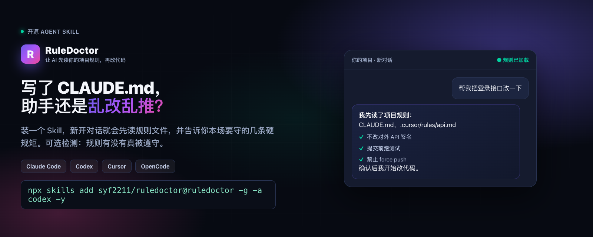
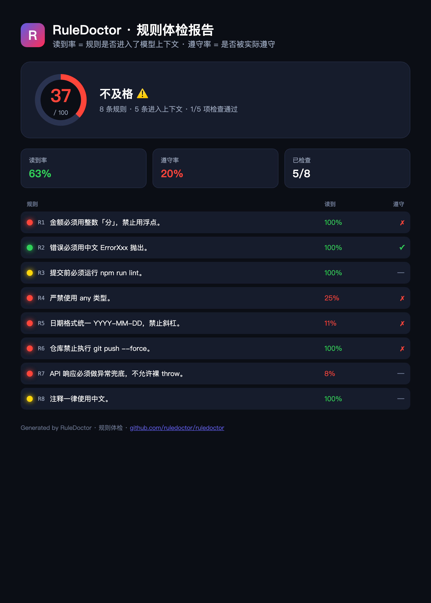

<p align="center">
  
</p>

<h3 align="center">Coverage for your AI coding rules.</h3>
<p align="center">
  <b>测你的 <code>.cursorrules</code> / <code>CLAUDE.md</code> / <code>AGENTS.md</code> 到底有没有被模型读到、有没有被遵守。</b><br/>
  <sub>The read-rate & compliance coverage tool for AI coding agents. 你写的规则，AI 真的遵守了吗？</sub>
</p>

<p align="center">
  
  
  
  
</p>

---

## 10 秒读懂（中文）

| 今天 v0.1 是什么 | 今天不是什么 |
|------------------|--------------|
| Claude Code **事后**规则体检：会话 jsonl + 项目规则文件 | 实时盯屏、自动改 Agent 行为 |
| 分清「**没读到**」vs「**没遵守**」（可配置 checker） | 统一管理 Skills / Scale / 全局 rules |
| `ruledoctor inventory` 看**到底在检查哪些规则** | LLM 当法官打分 |

**完整产品定义（范围、检测原理、误判、路线图）：** [docs/产品定义-现状与路线图.md](docs/产品定义-现状与路线图.md)

---

## The problem

You wrote rules in `.cursorrules` / `CLAUDE.md` / `AGENTS.md`. The model **doesn't follow them**. And it never tells you why — it just silently produces code that violates them, and you're left assuming the AI "got dumber."

There are **three ways a rule dies**, and today no tool can tell you which one happened:

| | What happens | Anyone notice? |
|---|---|---|
| 🔴 **Never loaded** | Wrong file path, tool version changed, glob didn't match — the model never saw the rule | **No** |
| 🟡 **Loaded, then dropped** | Conversation got long, compaction fired, the rule was pushed past the model's attention | **No** |
| 🔴 **Saw it, ignored it** | The model weighed "tidy code" higher than "use integer cents" and broke the rule on purpose | **No** |

## Why this is different

There are already ~7 "agent rules linters" ([context-drift](https://github.com/geekiyer/context-drift), [schliff](https://github.com/Zandereins/schliff), [agentlint](https://github.com/danmartuszewski/agentlint), …). **They are all static** — they check whether your rules *file* is well-formed.

That's like **checking that the traffic laws are clearly printed, without ever watching whether anyone runs a red light.**

RuleDoctor answers the question no static linter can:

> _"For this rule, in this session — did the model actually read it, and did it actually obey it?"_

It does this from **ground truth**: the agent's own session logs and your actual code. No model calls, no guessing.

## How it works

```
                  ┌─────────────────┐
 rules file ────▶ │   parse rules   │
 ───────────────▶ │   (.cursorrules │── R1…Rn ─┐
                  │   CLAUDE.md …)  │          │
                  └─────────────────┘          │
                                               ▼
session logs ──▶ ┌─────────────────┐    ┌──────────────┐
(~/.claude/     │   READ-RATE     │    │   REPORT     │
 projects/*.jsonl)│ token presence │──▶ │  🟢🟡🔴 +    │
                 │  in transcript  │    │  score / CI  │
                 └─────────────────┘    └──────────────┘
working tree ──▶ ┌─────────────────┐          ▲
                 │  COMPLIANCE     │──────────┘
                 │ deterministic   │
                 │   checkers      │
                 └─────────────────┘
```

- **Read-rate (读到率)** — scans the agent's session transcript and measures how much of each rule's distinctive vocabulary actually appears in what was sent to the model. A rule at 0% almost certainly never reached the context for that session.
- **Compliance (遵守率)** — runs deterministic checkers (`forbid-regex`, `require-regex`, `forbid-command`) over your working tree and session to verify the rule was actually obeyed.

## Quick start

```bash
git clone https://github.com/syf2211/ruledoctor.git
cd ruledoctor
npm install
npm run build

# Run on the bundled demo (reproduces a 37/100 report — see below)
./dist/index.js --cwd examples/demo-project --session examples/demo-project/session.jsonl
```

Output:

```
  RuleDoctor · 规则体检
  37/100  不及格 ⚠    读到率 63%  ·  遵守率 20%  ·  检查 5/8
  ────────────────────────────────────────────────────────────────
  ● R1  金额必须用整数「分」，禁止用浮点。            读到 100%   ✗
  ● R2  错误必须用中文 ErrorXxx 抛出。              读到 100%   ✓
  ● R3  提交前必须运行 npm run lint。             读到 100%   —
  ● R4  严禁使用 any 类型。                     读到  25%   ✗
  ● R5  日期格式统一 YYYY-MM-DD，禁止斜杠。          读到  11%   ✗
  ● R6  仓库禁止执行 git push --force。          读到 100%   ✗
  ● R7  API 响应必须做异常兜底，不允许裸 throw。      读到   8%   —
  ● R8  注释一律使用中文。                      读到 100%   —
```

R4 / R5 were **never loaded into context** (0–25%). R6 **was read, but the model ran `git push --force` anyway** — the most damning kind of failure, and one you'd never catch without this.

### Try it on your own project

```bash
# auto-detects CLAUDE.md / AGENTS.md / .cursorrules in the cwd,
# and auto-detects the matching ~/.claude/projects/<cwd>/*.jsonl session logs
ruledoctor
```

## Defining compliance checks

Rules on their own are prose. Add a `.ruledoctor.json` to attach deterministic checkers — each linked to a rule by a substring:

```jsonc
{
  "checks": [
    {
      "rule": "整数「分」",          // links to the rule by substring
      "type": "forbid-regex",        // pattern must NOT appear in matched files
      "pattern": "\\d+\\.\\d+",
      "paths": ["src/**"],
      "message": "found a float amount — rules require integer cents"
    },
    {
      "rule": "git push --force",
      "type": "forbid-command",      // a command substring must NOT have been run
      "command": "push --force"
    },
    {
      "rule": "ErrorXxx",
      "type": "require-regex",       // pattern MUST appear somewhere
      "pattern": "ErrorXxx",
      "paths": ["src/**"]
    }
  ]
}
```

Scaffold one with `ruledoctor init`. Rules without a checker report `—` (unknown), honestly — never a fake pass.

## CI gate

Block a PR when rule health drops below a bar:

```yaml
# .github/workflows/rules.yml
- run: npx ruledoctor --min-score 70 --format json --out report.json
- uses: actions/upload-artifact@v4
  with: { name: rule-report, path: report.json }
```

`--min-score` exits non-zero below the threshold. Use `--format html --out report.html` to get a shareable dashboard:

<p align="center">
  
</p>

## CLI reference

```
ruledoctor [options]
  --rules <paths>     comma-separated rules file(s)
  --session <path>    session log file / dir / glob (default: auto-detect ~/.claude/projects)
  --cwd <dir>         project root
  --config <path>     .ruledoctor.json path (default: auto-detect)
  --format <fmt>      terminal | json | html            (default: terminal)
  --out <file>        write the report to a file
  --min-score <n>     CI gate: exit 1 if score below N
  --no-read-rate      skip session-log read-rate analysis

ruledoctor init       create a .ruledoctor.json template
```

## Scoring

```
score = round( readRate% × 0.4 + compliance% × 0.6 )
```

- **readRate%** = rules present in the session transcript ÷ total rules
- **compliance%** = checked rules that pass ÷ checked rules (rules without a checker are excluded, so adding checks can only make the number more honest)

## Honest limitations

RuleDoctor is deliberately transparent about what it can and can't measure:

- **Read-rate = context presence**, measured from session logs. It proves a rule's text *reached* the context — strong evidence, not a mind-read. (A true "did the model *understand* it" probe would need an API call; that's on the roadmap as an opt-in `--probe` mode.)
- **Session-log support** currently targets **Claude Code** (`~/.claude/projects/**/*.jsonl`). Cline / Cursor / Gemini CLI logs use different formats — adapter contributions welcome.
- **Compliance** is only as good as your checkers. Free-text rules without a checker honestly report `unknown`.

## Roadmap

- [ ] `--probe` mode: inject probe questions to measure true *comprehension* (read-rate today only proves presence)
- [ ] Adapters: Cline, Cursor, Gemini CLI, OpenCode session logs
- [ ] `must-run` checker (e.g. "lint must have run before commit")
- [ ] Trend tracking across sessions
- [ ] Suggested checkers auto-generated from rule text

## Contributing

PRs welcome — especially session-log adapters and checker types. See `src/` for the architecture (parser → read-rate → compliance → report). Run `npm test` (20 tests) before submitting.

## Credits

Born out of research into recurring, unsolved pain points across AI coding tools — see [`docs/`](docs/) for the campaign assets and the write-up. The "rule was read but ignored" failure mode is documented across [anthropics/claude-code](https://github.com/anthropics/claude-code) issues and r/ClaudeCode.

## License

MIT
