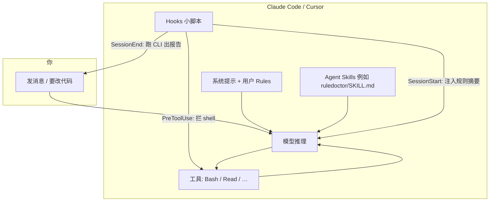

# Hook 是什么？（人话版）

本文说明 **RuleDoctor 里的 Hook** 在 Claude Code / Cursor 里到底干什么，以及它和 Skill、项目规则、系统提示的关系。读完应能判断：**某条规矩该写进 Skill，还是值得配 Hook / CLI 检查。**

---

## 1. Hook 到底是什么？

**Hook = 宿主（Claude Code / Cursor）在固定生命周期节点上，自动跑的一段小脚本。**

- 脚本从标准输入读一段 **JSON**（当前项目目录、要执行的 shell 命令、会话 transcript 路径等）。
- 脚本向标准输出写 **JSON**，告诉宿主：继续还是拒绝、要不要往上下文里塞一段文字、要不要给用户一条系统消息。
- **不经过模型「自觉」**：在工具真正执行前，宿主可以先问 Hook「允不允许」。

可以把它想成：

| 类比 | Hook |
|------|------|
| Git `pre-commit` | 提交前跑检查，不通过就拦 |
| 机场安检 | 登机（跑命令）前先扫一遍 |
| 不是 | 贴在墙上的员工手册（那是 Skill / CLAUDE.md） |

RuleDoctor 自带的 Hook 脚本在仓库 `scripts/`（安装 CLI 或 `setup` 后会写入你的 `~/.claude/settings.json` 或项目 `.cursor/hooks.json`）。

---

## 2. Hook 和 Skill / Rule / Prompt 的关系



| 机制 | 谁在读 | 典型作用 | 能「硬挡」吗 |
|------|--------|----------|--------------|
| **系统 Prompt / 用户 Rules** | 每次对话底层带上 | 全局习惯、IDE 规则 | 否，靠模型遵守 |
| **项目规则文件**（`CLAUDE.md`、`.cursor/rules` 等） | 模型 + 你 | 项目约定条文 | 否 |
| **Skill**（`skills/ruledoctor/SKILL.md`） | 模型在匹配场景时读 | 何时 Read 规则、怎么开场、口头拒绝 | **软**：不执行 ≠ 宿主拦截 |
| **Hook** | **宿主**在节点上跑脚本 | 注入上下文、拦命令、结束出报告 | **部分硬**：仅宿主支持的动作（如 deny Bash） |
| **CLI `ruledoctor`** | 你在终端跑 | 用 jsonl **事后**算读到率、配置的 checker | 否（审计） |

**一句话：** Skill 教 Agent **怎么想、怎么说**；Hook 在少数节点上 **替宿主做决定**；CLI 在会话结束后 **用日志算账**。

---

## 3. RuleDoctor 用了哪些触发时机？

以当前仓库实现为准（Claude Code 名 / Cursor 名对照）：

| 时机 | 何时发生 | RuleDoctor 脚本 | 对模型/用户的效果 |
|------|----------|-----------------|-------------------|
| **SessionStart** / `sessionStart` | 新开一场对话 | `reinject-rules.mjs` | 把项目规则 + `required_reads` **摘要**塞进 `additionalContext`（不是让用户看长篇） |
| **PreCompact** / `preCompact` | 上下文被压缩前 | 同上 | 压缩后容易忘规则 → **再注入**同一套锚点 |
| **PreToolUse (Bash)** / `beforeShellExecution` | 模型正要跑一条 shell | `rule-guard.mjs` | 命令字符串里命中违禁子串 → **deny**，工具不执行 |
| **SessionEnd** / `sessionEnd` | 本场对话结束 | `session-end.mjs` | 调 CLI 生成 HTML/终端报告，可选 `open` 报告 |

**没有实现的时机（所以别指望 Hook 管这些事）：**

- 用户每条消息发出前 / 模型每条回复发出前：**当前 RuleDoctor 没有 Hook**。
- Read、Edit、WebFetch 等非 Bash 工具：**没有** RuleDoctor 拦截器。
- 「这条回复是不是中文」「有没有写验证结果」：**没有**在回复出口做 Hook。

---

## 4. 两类规则：怎么检测？

### A. 命令式规则（适合 Hook 硬拦）

特征：能写成 **「不允许执行包含 X 的 shell」**。

| 例子 | RuleDoctor 怎么做 |
|------|-------------------|
| 禁止 `git push --force` | `rule-guard.mjs` 默认拦；也可在 `.ruledoctor.json` 里加 `forbid-command` |
| 禁止 `rm -rf /` | 同上（子串匹配） |
| 禁止 `curl … \| bash` | 在 `checks` 里配 `forbid-command` |

**触发点：** 仅 **Bash / shell 执行前**。  
**违规处理：** **拦截**（`permissionDecision: deny`），模型会看到拒绝原因，命令不会跑。

### B. 抽象行为规则（不适合用当前 Hook 硬拦）

| 例子 | 为什么 Hook 难办 |
|------|------------------|
| 对话必须用中文 | 要在 **模型输出文本** 上判断；现有 Hook 不接「回复前」 |
| 做完要汇报改了什么 | 属于回复结构与内容，不是一条 shell |
| 结束前要给验证结果 | 同上 |
| 不确定要说「不确定」 | 需要语义判断 |

**现实做法（推荐分层）：**

| 目标 | 推荐手段 | RuleDoctor 今天的能力 |
|------|----------|------------------------|
| 让模型 **尽量遵守** | 写进 `CLAUDE.md` + **Skill**（开场 3 条硬约束、`required_reads`） | ✅ Skill + reinject 注入摘要 |
| 让模型 **记得读** | `required_reads` + SessionStart/PreCompact 注入 | ✅ |
| **事后**发现「整场没用中文」 | 自定义 checker 扫 **会话 jsonl**（需自己写规则或扩展 CLI） | ⚠️ 仅有 `forbid-command` 扫 transcript；无「必须中文」内置 |
| **事后**发现「没跑测试」 | CLI `require-regex` 扫仓库文件（如报告里要有 `npm test` 输出痕迹） | ⚠️ 只能做很糙的启发式，且扫的是文件/日志不是「汇报质量」 |
| **硬保证** 某行为 | 只有能绑到 **工具或 CI** 时才行（如：merge 前 CI 必须绿） | Hook 只管 shell |

**诚实结论：**  
「必须用中文、必须汇报、必须说明验证」这类规则，**应主要写在 Skill + 项目规则里**；Hook **不能**在用户发消息或模型回复时自动纠错。SessionEnd 的 CLI 报告最多告诉你「规则文字有没有进上下文、配置的 forbid 有没有出现在 transcript」，**不会**自动帮模型补一段中文总结。

---

## 5. 检测到违规后会发生什么？

| 层 | 典型违规 | 系统反应 |
|----|----------|----------|
| **Hook · rule-guard** | 将要执行 `git push -f` | **拦截**：Bash 不跑，返回拒绝理由 |
| **Hook · reinject** | （无「违规」概念） | **提醒/补上下文**：注入规则摘要，对话继续 |
| **Hook · session-end** | （无实时违规） | **记录/展示**：生成报告，终端 `systemMessage` 摘要 |
| **Skill** | 用户要求 force push | 模型应 **拒绝并说明**（软，取决于模型） |
| **CLI** | transcript 里出现过 forbid 子串 | 报告里该条 **fail**（事后，拦不住已发生的） |

没有「自动替模型用中文补全回复」的流程——那属于另一类产品（输出过滤器 / 二次模型审阅），**不在本仓库 Hook 范围内**。

---

## 6. 该用 Hook 还是 Skill？

| 规则类型 | Skill | Hook | CLI 报告 |
|----------|:-----:|:----:|:--------:|
| 先读 `CLAUDE.md` / `required_reads` | ✅ 主 | ✅ 注入辅助 | ✅ 读到率 |
| 禁止 force push / 危险 shell | ✅ 口头拒 | ✅ **主（硬拦）** | ✅ 事后核对 |
| 用中文回复 | ✅ 主 | ❌ | △ 仅自定义启发式 |
| 改完要说明 diff / 验证步骤 | ✅ 主 | ❌ | △ |
| 不确定要声明 | ✅ 主 | ❌ | ❌ |

**只装 Skill、不装 Hook：** 多数抽象行为靠模型自觉；危险命令可能被模型拒绝，也可能不会。  
**Skill + Hook（`ruledoctor setup`）：** 危险 shell 多一道宿主拦截；长对话有 reinject；结束自动体检（可选）。  
**CLI：** 给自己看，不改变下一场对话行为。

---

## 7. 怎么启用 Hook（可选）

Skill **不需要** Hook。只有你要 **命令拦截 / 自动结束报告 / 压缩后注入** 时：

```bash
git clone https://github.com/syf2211/ruledoctor.git
cd ruledoctor && npm install && npm run build
node dist/index.js setup -p /path/to/your-project
# 或用户级：node dist/index.js bootstrap-skill  （写入 ~/.claude 与 ~/.cursor）
```

详见 [用户指南 · 可选 Hook](用户指南.md#可选项目里生成规则模板--hook)。

---

## 8. 和「理想 Hook」的差距（避免误解）

你可能期望：模型没汇报 → Hook 拦住发送。  
**Claude Code / Cursor 的 Hook 模型 today** 主要是：**会话生命周期 + 工具执行前**，不是「每条 assistant 消息的语法检查器」。

RuleDoctor 的定位是：在 **现有 Hook 能力内** 做规则锚点注入、Bash 拦截、会话结束审计；抽象行为规范交给 **Skill + 项目规则**，必要时用 **CI / 人工** 补最后一道门。

若未来宿主增加「PostAssistantMessage」类 Hook，可以再讨论「中文/汇报」类 checker——当前文档与代码 **不承诺** 已支持。
