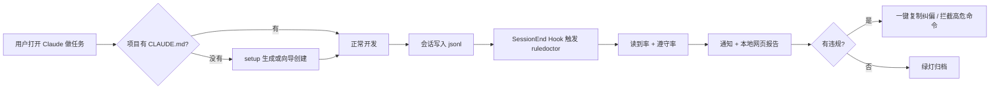

# RuleDoctor 产品设计（从零用户 → 安装 → 看结果 → 修复）

> 读者：从未听说过 `CLAUDE.md`、只用 Claude 桌面版开聊的人。  
> 写法：**一条故事线 + 8 个必答题**。  
> 标注：**【已有】** = 仓库里今天能跑；**【规划】** = 产品要补才能「即插即用」。

---

## 先讲一个完整故事（30 秒）

小李用 **Claude 桌面版**，在项目文件夹里让 Claude 改代码。他总觉得「AI 不听话」，但不知道是没看到规则，还是看到了故意没照做。

他只做一件事：对 Claude 说——

> **「帮我安装 RuleDoctor，以后每次任务结束自动告诉我规则有没有被遵守。」**

Agent 跑一段安装脚本（约 1 分钟）：装好 Skill；如用户需要增强层，再 clone/build CLI，在项目里生成 `CLAUDE.md` 模板（若还没有），并在 Claude Code 配置里挂一个 **CLI 可用时任务结束自动体检** 的 Hook。

从此小李**不用记命令**。每次会话结束，Claude 界面里会出现一张 **红绿灯卡片**（或浏览器自动打开本地小面板）：  
「8 条规则里 5 条进了上下文，2 条违反（浮点金额、force push），点一下复制纠偏话术。」

这就是目标体验。**今天仓库已完成 Skill 主入口、体检引擎、可选 Hook 基础能力；CLI 仍需 clone + build，尚未发 npm。** 下面分「目标」和「现状」说清楚。

---

## 1. 这个工具到底是什么形态？

### 结论（推荐对外只说这一句）

**RuleDoctor = 给 AI 编程 Agent 用的「先读规则 Skill + 可选规则体检/监督」本地工具。主入口是 Skill；CLI / Hook 是增强层。**

### 形态拆解（避免混在一起）

| 层次 | 是什么 | 作用 |
|------|--------|------|
| **主入口【已有】** | Agent Skill：`ruledoctor` | 先读规则文件与 `required_reads`，简短汇报硬约束 |
| **核心引擎【已有】** | Node CLI（源码 build 后运行） | 读规则文件 + 读会话日志 + 算分到报告 |
| **安装器【已有】** | `node dist/index.js setup -p <项目>` | 写 Hook、写模板、检测环境 |
| **不是** | 只靠 Skill 的强制合规系统 | Skill 是软约束；危险 shell 才能靠 Hook 硬拦 |
| **不是** | 替换 Claude / Cursor 内置 rules | 我们是**审计层**，在它们旁边 |
| **后续可选** | MCP 服务、Cursor 插件 | 把同一份引擎接到侧边栏 |

**为什么不只做 Skill？**  
Skill 能改变 Agent 的开场动作，但**体检本身**要读磁盘上的会话 jsonl 和项目文件，必须有本地程序（CLI）。Skill = 默认行为；CLI/Hook = 证据与硬拦。

**为什么不只做 CLI？**  
懒人不会敲命令；Hook + 自动打开报告才是产品。

---

## 2. 用户怎么安装？能一句话让 Agent 装好吗？

### 目标体验（后续）

**用户对 Agent 说：**

```text
请安装 RuleDoctor：在项目里启用任务结束自动规则体检，没有 CLAUDE.md 就帮我生成一个最简模板。
```

**Agent 实际执行（Skill 脚本化，约 3 步）：**

```bash
# 1. 安装 Skill
npx skills add syf2211/ruledoctor@ruledoctor -g -y

# 2. 可选：clone 源码后在当前项目初始化 CLI/Hook
cd "<用户项目目录>"
node /path/to/ruledoctor/dist/index.js setup -p . --yes
# setup 做：生成 CLAUDE.md（若缺失）、生成 .ruledoctor.json（常用检查器模板）、
#         往 ~/.claude/settings.json 写入 SessionEnd hook

# 3. 试跑上一次会话（可选）
node /path/to/ruledoctor/dist/index.js --cwd . --last-session
```

**即插即用标准：** 用户只说一句话；**不**要求理解 `CLAUDE.md` 路径、**不**要求手敲 `node dist/...`。

### 今天【已有】你能怎么装（诚实）

```bash
git clone https://github.com/syf2211/ruledoctor.git
cd ruledoctor && npm install && npm run build
# Skill 已可安装；CLI / Hook 需源码 build
```

**差距：** CLI 尚未发 npm；插件内 SessionEnd 报告依赖本机已有 CLI。

---

## 3. 规则从哪里来？

### 产品规则（三层来源，有优先级）

```text
┌─────────────────────────────────────────┐
│ 第 1 层：项目明文规则（主来源）            │
│ CLAUDE.md / AGENTS.md / .cursorrules …   │
│ 【已有】自动发现项目根多个文件并合并解析     │
├─────────────────────────────────────────┤
│ 第 2 层：遵守检查配置（判「违规」必需）     │
│ .ruledoctor.json 里的 checker            │
│ 【已有】需用户或 setup 模板生成            │
├─────────────────────────────────────────┤
│ 第 3 层：会话里出现的约束（辅助）           │
│ 用户首条长消息、<system_context> 等       │
│ 【规划】wizard 提炼为「候选规则」供确认，     │
│         不自动当正式规则（避免幻觉条款）     │
└─────────────────────────────────────────┘
```

**不当作规则来源的（今天）：**

- Claude **Skills** 列表（在 jsonl 的 attachment 里）→ 不自动导入  
- Scale 工作流步骤 → 不读  
- 厂商 system prompt 全文 → 不解析；仅当原文出现在会话文本时，可能影响「读到率」关键词匹配  

**【规划】Skills：** 可做「把某 Skill 的 MUST 条款同步进 CLAUDE.md」的**可选**动作，不是默认。

---

## 4. 如果用户没有 CLAUDE.md 怎么办？

### 这是不是正常？——**是，非常正常**

| 用户类型 | 典型情况 |
|----------|----------|
| Claude **桌面版**随便聊 | Often **没有**项目目录、没有 `CLAUDE.md` |
| 只在 Downloads / 桌面扔文件 | 有会话 jsonl，**没有**规则文件（你的 pain-points 会话就是这样） |
| Claude **Code** 进仓库干活 | 越来越多会有 `CLAUDE.md` / `AGENTS.md`，但不是 100% |

所以：**「没有 CLAUDE.md」不是 bug，是默认人群。**

### 产品应对（必须写进 setup，不能假设文件存在）

**第一次 `ruledoctor setup` 时：**

1. **检测**：项目根是否存在任一规则文件。  
2. **没有则三选一（默认 A）：**  
   - **A. 生成最简 `CLAUDE.md`（推荐）** — 5 条通用硬规矩（禁止 force push、改前先读、测试要求等），用户可改。  
   - **B. 从本次会话提炼「候选规则」** — 展示 5 条让用户勾选，勾选后写入 `CLAUDE.md`（不静默自动写）。  
   - **C. 仅「监视模式」** — 只分析会话里是否出现过某几句用户自填的「口头规矩」（弱，但比没有强）。  

**你的 pain-points 会话：**  
当时 cwd 是 `Downloads`，且任务本身是「调研」不是「写仓库」→ **没有 CLAUDE.md 完全正常**。演示里我们才单独写了 `pain-points-research-rules.md` 代表「假如你当时把这些写进了 CLAUDE.md」。

---

## 5. 「遵守率」和总分怎么算？为什么曾出现 100 分却「没检查」？

### 两个独立指标（不要混成一个「遵守」）

| 指标 | 问的问题 | 输入 | 方法【已有】 | 是不是 LLM 打分 |
|------|----------|------|--------------|----------------|
| **读到率** | 规则文本有没有出现在这次会话里？ | `~/.claude/projects/.../*.jsonl` | 规则拆关键词 → 在 transcript 里搜 | **否** |
| **遵守率** | 可验证的规矩有没有被打破？ | 工作区代码 + 会话里的命令文本 | `.ruledoctor.json` 里正则/禁止命令 | **否** |

### 「遵守」具体怎么判（仅对已配置 checker 的规则）

| checker 类型 | 判据 | 例子 |
|--------------|------|------|
| `forbid-regex` | 匹配文件里**出现**该正则 → **违规** | 禁止浮点 `\d+\.\d+` 在 `src/` 出现 |
| `require-regex` | 匹配文件里**没出现**该正则 → **违规** | 必须用 `ErrorXxx` |
| `forbid-command` | 会话 transcript 里**出现**命令子串 → **违规** | 禁止 `push --force` |

**没有配置 checker 的规则：** 遵守列显示 `—`（**不算过关，也不算失败**）。

### 总分公式【已有】`src/report.ts`

```text
读到率%  = (「读到」规则条数 / 规则总条数) × 100
          「读到」= 关键词匹配比例 ≥ 60%

遵守率%  = (通过的 checker 数 / 已配置 checker 数) × 100
          若 checker 数 = 0 → 遵守率显示 —，总分只采用读到率

总分     = 有 checker 时：读到率% × 40% + 遵守率% × 60%
          无 checker 时：读到率%
```

### 为什么无 checker 时不能说「遵守 100%」？

- 5 条调研约束在对话里**都聊过** → 读到率 100%  
- **没有** `.ruledoctor.json` → checker 数 = 0 → 遵守列显示 `—`
- 所以分数只代表 **「聊过这些话题」**，不是 **「代码与命令都合规」**

当前实现会显示 **「仅读到率，未配置遵守检查」**，避免把未检查误报成合规。

### demo 37 分才是「真体检」

- 有 `.ruledoctor.json`（5 个 checker）  
- 合成会话 + 故意违规代码 → 读到率 63%、遵守率 20% → **37 分**

---

## 6. 检测结果在哪里展示？（不能指望用户敲命令）

### 目标（【规划】按优先级）

| 渠道 | 时机 | 用户动作 |
|------|------|----------|
| **① Claude Code SessionEnd Hook** | 每次任务结束 | **零动作** — 终端/桌面通知里一张卡片 |
| **② 本地网页** | Hook 自动 `open` 或托盘图标 | 点链接看红绿灯报告（同 HTML 报告） |
| **③ 会话内 Agent 摘要** | Hook 把 3 行摘要写进 `summary` 文件，Agent 下次可读 | 可选 |
| **④ CI** | `git push` | 开发者用 `--min-score`【已有】 |

**桌面版 Claude（非 Code）：** 同样读 jsonl，但 Hook 挂载点取决于 Desktop 是否执行 `settings.json` hooks — **需实测**；若无，则 **文件夹监视 + 系统通知** 作为备选。

### 今天【已有】

- 终端打印  
- `--format html` 写文件，**用户自己 open**  
- 无 Hook、无自动弹窗、无侧边栏  

---

## 7. 检测出问题之后怎么办？

### 目标闭环（【规划】）

```text
发现违规 → 展示证据 → 一键动作
```

| 动作 | 说明 |
|------|------|
| **复制纠偏 Prompt** | `ruledoctor fix R6` 生成：「你违反了禁止 force push，请撤销并…」贴回 Claude |
| **阻止下一次（高危）** | PreToolUse Hook：命中 `forbid-command` 时拦截或二次确认 |
| **改规则文件** | 提示「这条规则从未被读到」→ 建议把规则缩短/移到 `CLAUDE.md` 顶部 |
| **自动改 CLAUDE.md** | **默认不自动**；仅生成 diff 建议，用户确认后写入 |

### 今天【已有】

- 终端列出违规项 + HTML 报告  
- **无** `fix`、**无** Hook 拦截  

---

## 8. 吸引力与噱头（为什么装？）

### 一句话噱头

**「Agent 不听话时，别猜是不是变蠢——一张图告诉你：规则根本没进脑子，还是进了脑子但没照做。」**

### 和「手动检查」差在哪

| 手动 | RuleDoctor |
|------|------------|
| 翻聊天记录猜 | 用 jsonl **机械对齐**规则关键词 |
| 肉眼看代码 | checker 扫 **整棵 src** |
| 不知道哪条规则失效 | **按条** R1–Rn 红绿灯 |
| 事后想不起来 | Hook **结束即提醒**（规划） |

### 为什么愿意装（对懒人）

- 安装：**一句话让 Agent 跑 setup**（规划）  
- 使用：**零命令**，结束任务就看卡片（规划）  
- 信任：**不调用 LLM 判案**，证据可点开（行号规划补全）  

### 和静态 rules linter 的差异（护城河）

它们检查「规则写得好不好」；我们检查「**这次任务里到底有没有读到、有没有违反**」。

---

## 端到端流程图（目标产品）



---

## 现状 vs 规划：一张表

| 能力 | 今天 | 下一版（MVP 产品） |
|------|------|-------------------|
| 引擎 CLI | ✅ | ✅ 发布 npm |
| `setup` + Agent Skill 安装 | ❌ | ✅ |
| 无 CLAUDE.md 向导 | ❌ | ✅ |
| SessionEnd 自动跑 | ❌ | ✅ |
| 无 checker 时禁止「假 100」 | ❌ | ✅ |
| 网页自动打开 | ❌ | ✅ |
| `fix` 纠偏话术 | ❌ | ✅ |
| 桌面 Claude 免终端 | ❌ | 通知 + 监视 jsonl |

---

## 给「完全从零」用户的一张纸（可直接贴进 README）

**你不需要懂 CLAUDE.md。**

1. 对 Claude 说：「安装 RuleDoctor。」（将来；今天让开发者 clone。）  
2. 它在你的项目里放一份「规矩清单」文件（没有就帮你建）。  
3. 每次干完活，它自动对比：**规矩有没有出现在这次对话里？代码/命令有没有犯规？**  
4. 看红绿灯网页，点一下复制「请按规矩重做」发给 Claude。  

**规矩从哪来？** 从你项目里的规矩文件来；没有就向导创建——**不是**从 Skills 自动扒。  

**分数怎么来的？** 读到 = 对话里搜关键词；遵守 = 你配的检查项（像 lint），**不是** AI 主观打分。  

---

## 开发优先级（落地顺序）

1. `ruledoctor setup` + 修正「无 checker 不显示 100 良好」  
2. SessionEnd Hook + 自动打开 `report.html`  
3. npm 发布或可下载 CLI artifact
4. 无 `CLAUDE.md` 向导（生成模板 + 可选从首条消息提炼）  
5. `ruledoctor fix` + jsonl 行号证据  

文档位置：`docs/产品设计-从零用户全流程.md`
